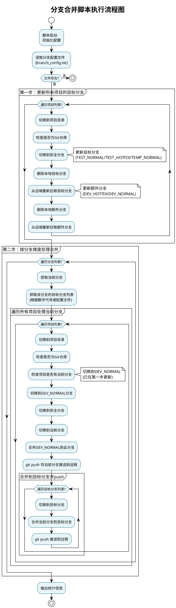

# 分支合并脚本使用说明

## 脚本功能

`branch_merge.sh` 脚本用于批量管理多个项目的 Git 分支，主要功能包括：

1. **删除并重新拉取目标分支**：删除本地的 `TEST_NORMAL`、`TEST_HOTFIX`、`TEMP_NORMAL` 分支，然后从远端重新拉取
2. **额外更新分支**：同时删除并重新拉取 `DEV_HOTFIX`、`DEV_NORMAL` 分支，确保源分支在第一步就已是最新状态
3. **合并操作**（按分支维度遍历）：
   - 先遍历配置的分支，再遍历项目
   - 直接切换到第一步已更新的 `DEV_NORMAL`，将其合并到从文件读取的分支列表中
   - 将这些分支合并到对应的目标分支（`TEST_NORMAL`、`TEST_HOTFIX`、`TEMP_NORMAL`）
   - **自动 push**：合并到目标分支后会自动 push 到远程仓库

## 使用方法

### 基本用法

```bash
# 使用默认的配置文件（branch_config.txt）
./branch_merge.sh

# 指定自定义的配置文件
./branch_merge.sh /path/to/your/branch_config.txt
```

### 文件配置

在脚本目录创建或编辑 `branch_config.txt` 文件：

```
# 分支配置文件
# 格式：分支名[:数字代号或目标分支名]
#
# 数字代号说明：
#   不写代号 = 默认合并到 TEST_NORMAL, TEST_HOTFIX
#   1 = TEST_NORMAL, TEST_HOTFIX, TEMP_NORMAL（全部）
#   2 = TEST_NORMAL
#   3 = TEST_HOTFIX
#   4 = TEMP_NORMAL
#
# 也支持直接写目标分支名（逗号分隔，大小写不敏感）
# 以 # 开头的行为注释，空行会被忽略

# 示例1：默认合并到 TEST_NORMAL 和 TEST_HOTFIX
feature_branch_1

# 示例2：合并到全部目标分支
feature_branch_2:1

# 示例3：只合并到 TEST_NORMAL
feature_branch_3:2

# 示例4：只合并到 TEST_HOTFIX
hotfix_branch_1:3

# 示例5：只合并到 TEMP_NORMAL
feature_branch_4:4

# 示例6：直接写目标分支名
feature_branch_5:TEST_NORMAL,TEMP_NORMAL
```

### 数字代号速查表

| 代号 | 合并到 |
|------|--------|
| 不写（默认） | TEST_NORMAL, TEST_HOTFIX |
| 1 | TEST_NORMAL, TEST_HOTFIX, TEMP_NORMAL（全部） |
| 2 | TEST_NORMAL |
| 3 | TEST_HOTFIX |
| 4 | TEMP_NORMAL |

## 脚本执行流程

### 整体流程

脚本会按以下顺序执行：

1. **读取配置文件**：读取 `branch_config.txt`，解析分支列表和映射关系
2. **第一步：更新所有项目的目标分支**：遍历所有项目，删除并重新拉取目标分支
3. **第二步：按分支维度处理合并**：先遍历配置的分支，再遍历项目进行处理

### 执行流程说明

#### 第一步：更新所有项目的目标分支

遍历所有项目，对每个项目执行：
1. 删除并重新拉取目标分支（`TEST_NORMAL`、`TEST_HOTFIX`、`TEMP_NORMAL`）
2. 额外删除并重新拉取 `DEV_HOTFIX`、`DEV_NORMAL` 分支（确保源分支在此步骤已更新到最新）

#### 第二步：按分支维度处理合并

**重要**：脚本采用**先按分支遍历，再按项目处理**的方式：
- 外层循环：遍历配置文件中的每个分支
- 内层循环：遍历所有项目，处理当前分支在该项目中的合并操作

对于每个配置的分支，在所有项目中执行以下操作：

1. **检查分支是否存在**：
   - 如果项目中没有该分支，跳过此项目
   - 如果本地分支不存在，尝试从远端拉取
   - 如果远端也不存在，跳过此项目

2. **切换到安全分支**：
   - 检查当前所在分支
   - 如果当前在目标分支（`TEST_NORMAL`、`TEST_HOTFIX`、`TEMP_NORMAL`）或源分支（`DEV_NORMAL`）上
   - 自动切换到其他分支（优先选择 `master` 或 `main`，否则选择其他可用分支）
   - **目的**：避免在需要删除或更新的分支上操作

3. **切换到 DEV_NORMAL 分支**：
   - DEV_NORMAL 已在第一步中删除并重新拉取，此处直接切换到本地 DEV_NORMAL
   - 如果本地 DEV_NORMAL 不存在，显示警告并继续

4. **将 DEV_NORMAL 合并到当前分支**：
   - 切换到安全分支
   - 切换到当前配置的分支
   - 执行 `git merge DEV_NORMAL --no-edit` 合并
   - 使用 `--no-edit` 自动使用默认合并提交信息
   - 合并成功后，执行 `git push origin <当前分支>` 将配置分支推送到远程
   - 如果合并失败（有冲突），显示错误并继续处理下一个项目

5. **将当前分支合并到目标分支并 push**：
   - 获取目标分支列表：
     - 如果配置文件中指定了代号或映射，使用对应的目标分支
     - 如果没有指定，默认合并到 `TEST_NORMAL` 和 `TEST_HOTFIX`
   - 切换到当前分支并更新：执行 `git pull` 更新到最新
   - 对每个目标分支：
     - 切换到目标分支
     - 执行 `git merge <分支名> --no-edit` 将分支合并到目标分支
     - **执行 `git push origin <目标分支>` 推送到远程**
     - 如果某个目标分支不存在，跳过
     - 如果合并或 push 失败，显示错误并继续处理下一个目标分支

6. **输出统计信息**：
   - 显示成功处理的项目数
   - 显示跳过的项目数
   - 显示失败的项目数

### 重要说明

1. **按分支维度遍历**：脚本采用先遍历分支、再遍历项目的方式，这样可以更清晰地看到每个分支在所有项目中的处理情况
2. **自动 push 操作**：合并到目标分支（`TEST_NORMAL`、`TEST_HOTFIX`、`TEMP_NORMAL`）后会自动 push 到远程仓库，无需手动操作
3. **额外分支更新**：第一步中除了目标分支外，还会额外删除并重新拉取 `DEV_HOTFIX` 和 `DEV_NORMAL`，确保源分支在合并前已是最新状态
4. **每个项目独立处理**：对于每个配置的分支，脚本会在所有项目中检查并处理，如果项目没有该分支则跳过
5. **错误处理**：如果某个步骤失败，脚本会显示警告但继续处理其他项目或分支，不会中断整个流程
6. **分支存在性检查**：脚本会检查本地和远端的分支是否存在，如果都不存在会跳过并显示警告
7. **安全分支切换**：在执行关键操作前，脚本会自动切换到安全分支，避免在需要删除或更新的分支上操作
8. **远程信息更新**：在删除本地分支前，会先执行 `git fetch` 确保获取最新的远程分支信息
9. **默认行为**：不写代号默认只合并到 TEST_NORMAL 和 TEST_HOTFIX，需要 TEMP_NORMAL 请用代号 `1` 或 `4`

## 执行流程图

### 详细流程图

```plantuml
@startuml 分支合并脚本执行流程图
!theme plain
skinparam backgroundColor #FFFFFF
skinparam activity {
    BackgroundColor #E8F4F8
    BorderColor #2E7D9A
    FontColor #000000
    FontSize 12
}

title 分支合并脚本执行流程图

start

:脚本启动;
:初始化配置\n(项目列表、分支名称等);

:读取分支配置文件\n(branch_config.txt);
if (文件是否存在?) then (否)
    :输出错误信息;
    stop
else (是)
    :解析分支配置\n(分支列表和映射关系);
endif

:显示要处理的分支列表;

partition "第一步：更新所有项目的目标分支" {
    :初始化统计信息\n(成功/跳过/失败计数);
    
    while (还有项目未处理?)
        :获取下一个项目;
        
        if (项目目录是否存在?) then (否)
            :跳过此项目;
            :跳过计数+1;
        else (是)
            :切换到项目目录;
            
            if (是否为Git仓库?) then (否)
                :跳过此项目;
                :跳过计数+1;
            else (是)
                :切换到安全分支\n(不在目标分支或源分支上);
                if (切换失败?) then (是)
                    :标记项目处理失败;
                    :失败计数+1;
                else (否)
                    partition "更新目标分支" {
                        while (还有目标分支未处理?)
                            :获取目标分支\n(TEST_NORMAL/TEST_HOTFIX/TEMP_NORMAL);
                            :git fetch 更新远程信息;
                            if (本地分支存在?) then (是)
                                :删除本地分支;
                            else (否)
                            endif
                            if (远端分支存在?) then (是)
                                :从远端拉取并创建本地分支;
                            else (否)
                                :跳过此分支;
                            endif
                        endwhile
                    }
                    
                    partition "更新额外分支" {
                        while (还有额外分支未处理?)
                            :获取额外分支\n(DEV_HOTFIX/DEV_NORMAL);
                            if (本地分支存在?) then (是)
                                :删除本地分支;
                            else (否)
                            endif
                            if (远端分支存在?) then (是)
                                :从远端拉取并创建本地分支;
                            else (否)
                                :跳过此分支;
                            endif
                        endwhile
                    }
                endif
            endif
        endif
    endwhile
}

partition "第二步：按分支维度处理合并" {
    :初始化统计信息\n(成功/跳过/失败计数);
    
    while (还有分支未处理?)
        :获取下一个配置的分支;
        :获取该分支的目标分支列表\n(根据数字代号或配置文件);
        
        if (目标分支列表为空?) then (是)
            :跳过此分支;
        else (否)
            partition "遍历所有项目处理当前分支" {
                while (还有项目未处理?)
                    :获取下一个项目;
                    
                    if (项目目录是否存在?) then (否)
                        :跳过此项目;
                    else (是)
                        :切换到项目目录;
                        
                        if (是否为Git仓库?) then (否)
                            :跳过此项目;
                        else (是)
                            if (项目是否有当前分支?) then (否)
                                :跳过此项目\n(项目没有该分支);
                            else (是)
                                :切换到安全分支;
                                
                                partition "切换到DEV_NORMAL" {
                                    if (本地DEV_NORMAL分支存在?) then (是)
                                        :切换到DEV_NORMAL分支\n(已在第一步更新);
                                    else (否)
                                        :跳过（DEV_NORMAL本地不存在）;
                                    endif
                                }
                                
                                :切换到安全分支;
                                
                                partition "合并DEV_NORMAL到当前分支" {
                                    if (分支是否存在?) then (否)
                                        if (远端分支存在?) then (是)
                                            :从远端创建本地分支;
                                            :切换到该分支;
                                            :将DEV_NORMAL合并到此分支;
                                        else (否)
                                            :跳过此分支;
                                        endif
                                    else (是)
                                        :切换到该分支;
                                        :将DEV_NORMAL合并到此分支;
                                    endif
                                    :git push 将当前分支推送到远程;
                                }
                                
                                partition "将当前分支合并到目标分支并push" {
                                    :切换到当前分支;
                                    :git pull 更新分支;
                                    
                                    while (还有目标分支未处理?)
                                        :获取目标分支;
                                        if (目标分支存在?) then (是)
                                            :切换到目标分支;
                                            :将当前分支合并到目标分支;
                                            :git push 推送到远程;
                                        else (否)
                                            :跳过此目标分支;
                                        endif
                                    endwhile
                                }
                                
                                :项目处理完成;
                                :成功计数+1;
                            endif
                        endif
                    endif
                endwhile
            }
        endif
    endwhile
}

:输出统计信息\n(成功/跳过/失败数量);

stop

@enduml
```



### 简化流程图



## 配置说明

脚本中的配置项（可在脚本开头修改）：

```bash
REMOTE_NAME="origin"                    # 远程仓库名称
PROJECTS_ROOT="/Users/harvey/Documents/JST/projects"  # 项目根目录
TARGET_BRANCHES=("TEST_NORMAL" "TEST_HOTFIX" "TEMP_NORMAL")  # 目标分支列表（大写）
EXTRA_UPDATE_BRANCHES=("DEV_HOTFIX" "DEV_NORMAL")  # 额外需要更新的分支（第一步中一并处理）
SOURCE_BRANCH="DEV_NORMAL"              # 源分支（大写）
BRANCH_CONFIG_FILE="${SCRIPT_DIR}/branch_config.txt"  # 分支配置文件路径
```

## 项目列表

脚本会处理以下项目（可在脚本中修改 `PROJECTS` 数组）：

- dis-aftersale-service
- dis-common
- dis-company-service
- dis-innerorder-service
- dis-inner-common
- security-service

## 输出说明

脚本会输出详细的执行日志，包括：

- `[INFO]`：信息提示（蓝色）
- `[✓]`：成功操作（绿色）
- `[!]`：警告信息（黄色）
- `[✗]`：错误信息（红色）

脚本启动时会显示：
- 项目根目录
- 配置文件路径
- 源分支名称
- 目标分支列表
- 额外更新分支列表
- 配置的分支数量

最后会显示统计信息：
- 成功处理的项目数
- 跳过的项目数
- 失败的项目数

## 注意事项

1. **备份重要数据**：执行脚本前请确保重要代码已提交或备份
2. **自动 push**：脚本会自动将合并后的目标分支 push 到远程，请确保有 push 权限
3. **合并冲突**：如果出现合并冲突，脚本会显示错误信息，需要手动解决冲突后重新运行脚本
4. **网络连接**：确保网络连接正常，能够访问远程仓库
5. **权限问题**：确保对项目目录有读写权限，以及对远程仓库有 push 权限
6. **分支存在性**：如果某个分支在远端不存在，脚本会跳过并显示警告
7. **执行顺序**：脚本按分支维度遍历，先处理完一个分支在所有项目中的合并，再处理下一个分支
8. **默认行为**：不写代号默认只合并到 TEST_NORMAL 和 TEST_HOTFIX，需要 TEMP_NORMAL 请用代号 `1` 或 `4`

## 示例场景

### 场景1：所有分支使用默认目标

**branch_config.txt**:
```
feature_001
feature_002
```

结果：`feature_001` 和 `feature_002` 都会合并到 `TEST_NORMAL`、`TEST_HOTFIX` 并自动 push

### 场景2：使用数字代号

**branch_config.txt**:
```
feature_001:1
hotfix_001:3
feature_002
```

结果：
- `feature_001` 合并到 `TEST_NORMAL`、`TEST_HOTFIX`、`TEMP_NORMAL`（全部）并自动 push
- `hotfix_001` 只合并到 `TEST_HOTFIX` 并自动 push
- `feature_002` 合并到 `TEST_NORMAL`、`TEST_HOTFIX`（默认）并自动 push

### 场景3：混合使用数字代号和分支名

**branch_config.txt**:
```
feature_001:2
hotfix_001:TEST_HOTFIX
feature_002:TEST_NORMAL,TEMP_NORMAL
feature_003
```

结果：
- `feature_001` 只合并到 `TEST_NORMAL` 并自动 push
- `hotfix_001` 只合并到 `TEST_HOTFIX` 并自动 push
- `feature_002` 合并到 `TEST_NORMAL` 和 `TEMP_NORMAL` 并自动 push
- `feature_003` 合并到 `TEST_NORMAL`、`TEST_HOTFIX`（默认）并自动 push

## 故障排除

### 问题1：脚本无法执行

```bash
# 确保脚本有执行权限
chmod +x branch_merge.sh
```

### 问题2：找不到配置文件

确保 `branch_config.txt` 文件存在于脚本目录，或使用绝对路径指定文件位置。

### 问题3：合并冲突

如果出现合并冲突，脚本会停止并显示错误。需要：
1. 手动解决冲突
2. 提交合并结果
3. 重新运行脚本

### 问题4：无法删除本地分支

如果分支正在被使用（当前所在分支），脚本会自动切换到其他分支后再删除。
