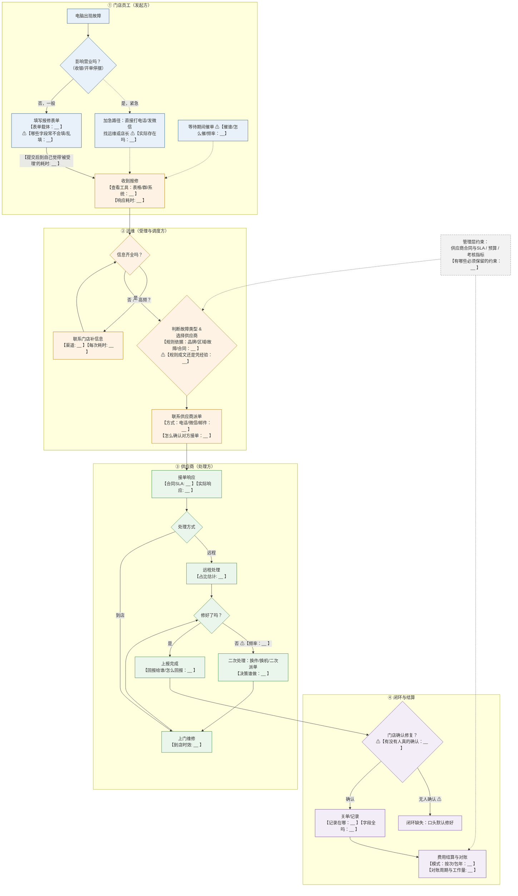

# 门店电脑报修 · 现状流程图模板（As-Is）

> 使用说明：访谈/观察后把每个节点旁【 】里的空填上实际情况；⚠ 是预设的常见卡点，未发现就删掉该标注；虚线 = 疑似「表单之外」的真实路径（电话/微信群催办、绕流程加急），重点确认其存在与频率；耗时尽量给「典型值 + 最差值」。

```mermaid
flowchart TD
    %% ---------- 门店员工 ----------
    subgraph S1["① 门店员工（发起方）"]
        A1["电脑出现故障"] --> A2{"影响营业吗？<br/>（收银/开单停摆）"}
        A2 -. "是，紧急" .-> A3["加急路径：直接打电话/发微信<br/>找运维或店长 ⚠【实际存在吗：__】"]
        A2 -- "否，一般" --> A4["填写报修表单<br/>【表单载体：__ 】<br/>⚠【哪些字段常不会填/乱填：__】"]
        A3 -.-> B1
        A4 -- "【提交后到自己觉得'被受理'的耗时: __ 】" --> B1
        A6["等待期间催单 ⚠【催谁/怎么催/频率：__】"] -.-> B1
    end

    %% ---------- 运维 ----------
    subgraph S2["② 运维（受理与调度方）"]
        B1["收到报修<br/>【查看工具：表格/群/系统：__ 】<br/>【响应耗时: __ 】"] --> B2{"信息齐全吗？"}
        B2 -- "否 ⚠ 高频？" --> B3["联系门店补信息<br/>【渠道: __ 】【每次耗时: __ 】"]
        B3 --> B2
        B2 -- "是" --> B4{"判断故障类型 &<br/>选择供应商<br/>【规则依据：品牌/区域/故障/合同：__ 】<br/>⚠【规则成文还是凭经验：__】"}
        B4 --> B5["联系供应商派单<br/>【方式：电话/微信/邮件：__ 】<br/>【怎么确认对方接单：__ 】"]
    end

    %% ---------- 供应商 ----------
    subgraph S3["③ 供应商（处理方）"]
        C1["接单响应<br/>【合同SLA: __ 】【实际响应: __ 】"] --> C2{"处理方式"}
        C2 -- 远程 --> C3["远程处理<br/>【占比估计: __ 】"]
        C2 -- 到店 --> C4["上门维修<br/>【到店时效: __ 】"]
        C3 --> C5{"修好了吗？"}
        C4 --> C5
        C5 -- "否 ⚠【频率：__ 】" --> C6["二次处理：换件/换机/二次派单<br/>【决策谁做：__ 】"]
        C6 --> C4
        C5 -- "是" --> C7["上报完成<br/>【回报给谁/怎么回报：__ 】"]
    end

    B5 --> C1

    %% ---------- 闭环 ----------
    subgraph S4["④ 闭环与结算"]
        D1{"门店确认修复？<br/>⚠【有没有人真的确认：__ 】"} -- "无人确认 ⚠" --> D2["闭环缺失：口头默认修好"]
        D1 -- "确认" --> D3["关单/记录<br/>【记录在哪：__ 】【字段全吗：__ 】"]
        D3 --> D4["费用结算与对账<br/>【模式：按次/包年：__ 】<br/>【对账周期与工作量: __ 】"]
    end

    C7 --> D1

    %% ---------- 管理层约束（影响全流程的外部条件） ----------
    M1["管理层约束：<br/>供应商合同与SLA / 预算 / 考核指标<br/>【有哪些必须保留的约束：__ 】"]
    M1 -.-> B4
    M1 -.-> D4

    %% ---------- 样式 ----------
    classDef store fill:#E8F1FA,stroke:#1F4E79,stroke-width:1px
    classDef ops fill:#FDF2E3,stroke:#B07A00,stroke-width:1px
    classDef vendor fill:#EAF6EC,stroke:#2E7D32,stroke-width:1px
    classDef close fill:#F3EDF7,stroke:#6A3D8F,stroke-width:1px
    classDef mgmt fill:#F2F2F2,stroke:#7F7F7F,stroke-width:1px,stroke-dasharray:4 3
    class A1,A2,A3,A4,A6 store
    class B1,B2,B3,B4,B5 ops
    class C1,C2,C3,C4,C5,C6,C7 vendor
    class D1,D2,D3,D4 close
    class M1 mgmt
```
