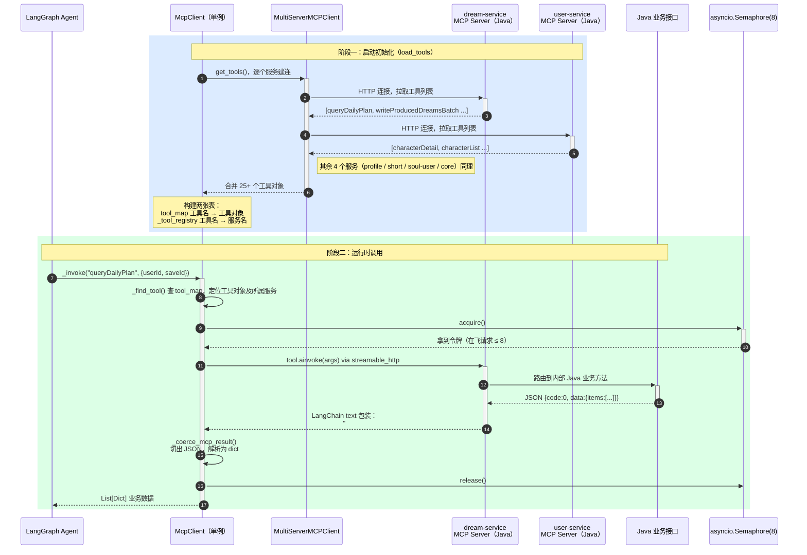

# MCP 工具集成 — 序列图

## 完整调用流程

## 说明

| 步骤 | 关键点 |
|------|-------|
| 1–6 初始化 | 启动时一次性连接全部 MCP Server，构建 tool_map，后续调用不再重新连接 |
| 7 查路由 | `_find_tool()` 先查 tool_map，找不到再按 `_TOOL_ROUTING` 静态表兜底 |
| 8 限流 | Semaphore 控制并发上限，LLM 调用和 MCP 调用共用同一个，防 Serverless 实例 OOM |
| 9 HTTP | transport 为 `streamable_http`，Java MCP Server 暴露标准 MCP 端点 |
| 11 解包 | LangChain 把 Java 返回的 JSON 包成 text 格式，需从 `## Original Response` 后截取再解析 |
| Session 失效 | 遇 `session terminated` 等错误触发 `reload_tools()`，重建全部连接后重试 |
